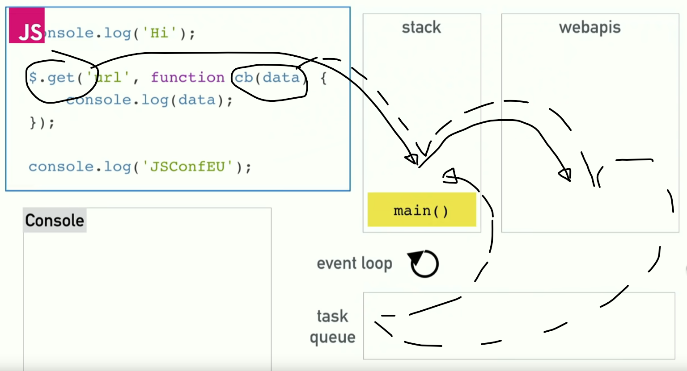
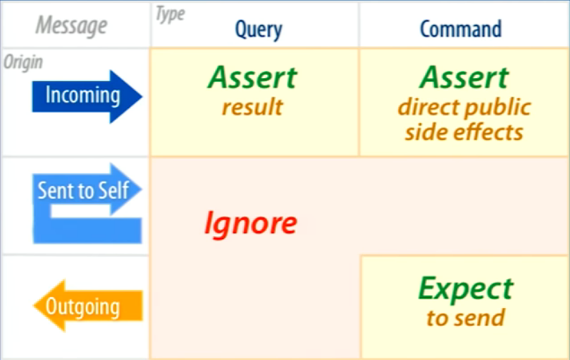

# markdown

preview in new tab Ctrl+Shift+V

preview side-by-side Ctrl+K V

[markdown guide](https://www.markdownguide.org/basic-syntax/)

# object constructors

different ways of making objects

-   literal
-   constructor
-   factory function
-   module
-   class

## things to know about constructors and objects

### this

a special keyword

it's used in the constructor (and prototype) to refer to the eventual object created with the constructor

```js
function Student(name, grade) {
    this.grade = grade;
    this.name = name;
}
let bob = new Student("bob", 5);
bob.name; // 'bob'
```

### prototype

stuff in the body of the constructor is duplicated onto the objects

stuff in the prototype property of the constructor is used by the objects, but lives in the constructor

### inheritance

you can make a child constructor that inherits the prototype of the parent constructor

when a prototype-defined method is called on an object, js will walk up the prototype chain until it finds the method

[inheritance on mozilla](https://developer.mozilla.org/en-US/docs/Learn/JavaScript/Objects/Inheritance)

### privacy / scoping

some of the constructor types take advantage of function scope to allow you to hide its members from the outside world

### namespace

fancy word for the name of an object

if you put a bunch of related props and methods into a single object, the name of the object is the 'namespace' for those props and methods

e.g. the 'book' namespace might include book.title, book.markAsRead(), etc

## object literal

this is when you just type it out

```js
bob = {
	name = 'bob',
	grade = 12
}
```

as far as I know, inheritance and prototype don't apply to literals

## object constructor

a special category of function

requires 'new' to invoke

if you leave out 'new', weird things will happen

### basic version

```js
function Student(name, grade) {
    this.grade = grade;
    this.name = name;
}
let bob = new Student("bob", 5);
bob.name; // 'bob'
```

### with method ... wrong way

-   method in body instead of prototype
-   method will be repeated in each child object

```js
function Student(name, grade) {
    this.name = name;
    this.grade = grade;
    this.sayName = function () {
        console.log(`Hi I'm ${name}.`);
    };
}
```

### with method ... right way

-   method on prototype
-   method lives in only one place, js will use the protoype chain to find it)

```js
function Student(name, grade) {
    this.name = name;
    this.grade = grade;
}

Student.prototype.sayName = function () {
    console.log(`Hi I'm ${this.name}.`);
};

let bob = new Student("bob", 5);
bob.sayName; // Hi I'm bob.
```

#### inheritance ... make a 'child' constructor

```js
function EighthGrader(name) {
    this.name = name;
    this.grade = 8;
}

EighthGrader.prototype = Object.create(Student.prototype);

let bob = new EighthGrader("bob");
bob.sayName; // Hi I'm bob.
```

## factory function

plain old function that returns an object

doesn't need the 'new' keyword to invoke

includes a return statement, so you can have private members

```js
const personFactory = (name, age) => {
    const sayHello = () => console.log("hello!");
    return { name, age, sayHello };
};

const jeff = personFactory("jeff", 27);
console.log(jeff.name); // 'jeff'
jeff.sayHello(); // calls the function and logs 'hello!'
```

### privacy

only exposes members in the return statement

closure: functions retain their scope even if they are passed around and called outside of that scope.

```js
const FactoryFunction = (string) => {
    const capitalizeString = () => string.toUpperCase();
    const printString = () => console.log(`----${capitalizeString()}----`);
    return { printString };
};

const taco = FactoryFunction("taco");

printString(); // ERROR!!
capitalizeString(); // ERROR!!
taco.capitalizeString(); // ERROR!!
taco.printString(); // this prints "----TACO----"
```

capitalizeString is a private function and printString is public

because capitalizeString isn't returned by the FF, we can't call it. but printString can

FF closures allow us to create private variables and functions that are used in the workings of our objects but are not intended to be used elsewhere in our program

In other words, even though our objects might only do one or two things, we are free to split our functions up as much as we want (allowing for cleaner, easier to read code) and only export the functions that the rest of the program is going to use.

### inheritance

if the 'parent' returns something that you want the child to have, you can inherit it like this

```js
const Person = (name) => {
    const sayName = () => console.log(`my name is ${name}`);
    return { sayName };
};

const Nerd = (name) => {
    // create a person and pull out the sayName function with destructuring assignment syntax
    const { sayName } = Person(name);
    const doSomethingNerdy = () => console.log("nerd stuff");
    return { sayName, doSomethingNerdy };
};

const jeff = Nerd("jeff");

jeff.sayName(); //my name is jeff
jeff.doSomethingNerdy(); // nerd stuff
```

## module pattern ... different from ES6 modules (i.e. import / export modules)

module pattern wraps a factory in an IIFE (Immediately Invoked Function Expression)

basically a single use FF

example 1

```js
const calculator = (() => {
	const add = (a, b) => a + b;
	const sub = (a, b) => a - b;
	const mul = (a, b) => a \* b;
	const div = (a, b) => a / b;
	return {
		add,
		sub,
		mul,
		div,
	};
})();

calculator.add(3,5) // 8
calculator.sub(6,2) // 4
calculator.mul(14,5534) // 77476
```

example 2 (note the underscores are a style thing, not required)

```js
var myModule = (function () {
    "use strict";

    var _privateProperty = "Hello World";

    function _privateMethod() {
        console.log(_privateProperty);
    }

    return {
        publicMethod: function () {
            _privateMethod();
        },
    };
})();

myModule.publicMethod(); // outputs 'Hello World'
console.log(myModule._privateProperty); // is undefined protected by the module closure
myModule._privateMethod(); // is TypeError protected by the module closure
```

## classes

compiles to ordinary constructors and prototypes behind the scenes

requires `new`

note the functions are outside of the class's constructor for inheritance purposes

```js
class Person {
    constructor(first, last, age, gender, interests) {
        this.name = {
            first,
            last,
        };
        this.age = age;
        this.gender = gender;
        this.interests = interests;
    }

    greeting() {
        console.log(`Hi! I'm ${this.name.first}`);
    }

    farewell() {
        console.log(`${this.name.first} has left the building. Bye for now!`);
    }
}

let han = new Person("Han", "Solo", 25, "male", ["Smuggling"]);
han.greeting(); // Hi! I'm Han
```

### inheritance

uses `extends` and `super`

```js
class Teacher extends Person {
    constructor(first, last, age, gender, interests, subject, grade) {
        // need to call 'super', which will call the class that's getting extended (in this case Person)
        super(first, last, age, gender, interests);

        // subject and grade are specific to Teacher
        this.subject = subject;
        this.grade = grade;
    }
}

let snape = new Teacher(
    "Severus",
    "Snape",
    58,
    "male",
    ["Potions"],
    "Dark arts",
    5
);
snape.greeting(); // Hi! I'm Severus.
snape.farewell(); // Severus has left the building. Bye for now.
snape.age; // 58
snape.subject; // Dark arts
```

### privacy

supported by chrome and edge, but not by ff or safari

so you can use this syntax, but only if you add babel to your project

```js
class ClassWithPrivateMethod {
    #privateMethod() {
        return "hello world";
    }

    getPrivateMessage() {
        return this.#privateMethod();
    }
}

const instance = new ClassWithPrivateMethod();
console.log(instance.getPrivateMessage()); // expected output: "hello worl​d"
```

### classes have a special syntax around getters and setters

this is a dumb example, but they are useful when you need to run some code on a value before storing / retrieving

```js
class Teacher extends Person {
    constructor(first, last, age, gender, interests, subject, grade) {
        super(first, last, age, gender, interests);
        // subject and grade are specific to Teacher
        this._subject = subject;
        this.grade = grade;
    }

    get subject() {
        return this._subject;
    }

    set subject(newSubject) {
        this._subject = newSubject;
    }
}

let snape = new Teacher(
    "Severus",
    "Snape",
    58,
    "male",
    ["Potions"],
    "Dark arts",
    5
);

// Check the default value
console.log(snape.subject); // Returns "Dark arts"

// Change the value
snape.subject = "Balloon animals"; // Sets _subject to "Balloon animals"

// Check it again and see if it matches the new value
console.log(snape.subject); // Returns "Balloon animals"
```

# npm, ES6 modules, webpack, babel

## npm ... node package manager

### basics

make a new project folder

cd into it

run `npm init`

npm will create a `node_modules` folder and a `package.json` file

add packages to your project with `npm install --save <package name>`

-   when installing a package that will be bundled into production, you should use --save
-   installing for development purposes (e.g. a linter, testing libraries, etc.) should use npm install --save-dev.

npm will download the package to node_modules and add it to the dependencies field in package.json

in your code, you can access a package with `import <package name>`

`package.json` should be included in git, `node_modules` should not

exclude `node_modules` by putting `.gitignore` at root with these lines

```js
# Ignore node_modules folder
node_modules
```

if you clone a repo, it should already have a package.json

instead of `npm init`, run `npm install` to get all the dependencies from package.json

### misc

uninstall packages with: `npm uninstall <package name>`

check version with: `npm list <package name>`

upgrade with: `npm update <package name>`

## ES6 modules ... import / export

write some chunk of code in its own file

at the end of the file, use an `export` statement to make your chunk available elsewhere

go to another file

pull in whatever exported chunks you need with `import`

## webpack

npm puts all the dependency code in node_modules. your code wants to use ES6 modules to access it with `import <package name>`. but browsers don't know how to connect `import` to node_modules

further, not all browsers can understand ES6 import / export

webpack is a build step that addresses both issues

webpack dependencies ... here's the cli commands, but they will actually get installed by package.json

```js
npm install webpack webpack-cli --save
npm install webpack-dev-server --save-dev
```

make webpack.config.js (see below)

make src and dist folders

put index.html in dist, put all your code in src with index.js as the entry point

webpack will create main.js in dist

point index.html at main.js in dist

```js
// webpack.config.js ... note this is over simplified ... see ./js/webpack

const path = require("path");

module.exports = {
    entry: "./src/index.js",
    output: {
        filename: "bundle.js",
        path: path.resolve(__dirname, "dist"),
    },
    devServer: {
        contentBase: path.resolve(__dirname, "dist"),
        watchContentBase: true,
    },
};
```

## babel

browsers lag behind new js features

babel transpiles modern js into old js that all browsers can understand

babel dependencies ... here's the cli command, but they will actually get installed by package.json

```js
npm install @babel/core @babel/preset-env babel-loader --save
```

babel core 7.12.10 doesn't by default have support for async / await, so you also have to install

```js
npm install --save-dev @babel/plugin-transform-runtime
npm install --save-dev @babel/runtime
```

add babel rules to webpack.config.js

```js
{
    test: /\.m?js$/,
    exclude: /node_modules/,
    use: {
        loader: "babel-loader",
        options: {
            presets: [
                ["@babel/preset-env", { targets: "defaults" }],
            ],
            plugins: ["@babel/transform-runtime"],
        },
    },
},
```

## back to npm

add to package.json scripts

```js
"build": "webpack --progress --mode=production",
"watch": "webpack --progress --watch"
"serve": "webpack serve --mode development --env development"
```

`npm run build` will bundle the site to src

`npm run watch` will update the bundle as you make changes ... but you still have to refresh the browser to see the dev stuff

`npm run serve` will serve the site to localhost and hot reload any changes

## starter-dir

everything is set up (with simple webpack config which respects hard-coded html)

copy starter-dir, rename it, cd into it, and run `npm install`

note sometimes it bugs out. try:

```js
method 1
	npm clean-install
method 2
	npm install webpack webpack-cli --save
	npm install webpack-dev-server --save-dev
```

# async

## basics

client side js == js runtime and the stack + web api + task queue and the event loop + painting



[very good talk on youtube](https://www.youtube.com/watch?v=8aGhZQkoFbQ)

### js runtime and the stack

js runtime can only do one thing at a time

as it encounters tasks, it adds them to the top of the stack

it always works on whatever task is on top of the stack

when it finishes the task on top of the stack, it removes it and gets to work on the 'new' top-of-stack task

```js
function a() {
    b();
}

function b() {
    ...
}

// stack: add a(), add b(), clear b(), clear a()
```

### web api

web api is like a separate runtime with its own stack

when the js runtime adds an api call to the js stack, the call gets 'executed' by the js stack right away by adding it to the api stack. it is then cleared from the js stack, but might take a while to get executed on the api stack.

these api calls are things like network requests

they are called with a callback function: once the network request is resolved, do xyz

the api stack waits for the api call (eg network request) to resolve, then has to get the callback (eg do xyz) back to the js runtime

### task queue and the event loop

the web api sends the callback to the task queue

the event loop watches the js stack. when it's empty it adds an item from the task queue

### painting

in addition to orchestrating the above, the browser wants to 'paint' or refresh the UI at 60Hz (every 16.7ms)

painting can get slipped into the js stack by the event loop

therefore, slow tasks can block repainting and should be handled carefully

## callback, Promise / .then, async / await

dealing with 'do x and when x is done, do y'

### callback

callback on callback on callback gets hard to follow

```js
chooseToppings(function (toppings) {
    placeOrder(
        toppings,
        function (order) {
            collectOrder(
                order,
                function (pizza) {
                    eatPizza(pizza);
                },
                failureCallback
            );
        },
        failureCallback
    );
}, failureCallback);
```

### Promise / .then

Promise is a built in constructor, like Array

the Promise constructor wraps a function and transforms the return into a `promise` object

when a `promise` is created, it is initially `pending`. then it `resolves` to either `fulfilled` or `rejected`

a `fulfilled promise` sends the returned value to a `.then()`

a `rejected promise` sends an error value to a `.catch()`

i.e. if a `promise` is `fulfilled`, send the response to whatever is in `.then()`. if it's `rejected`, send the response to `.catch()`

each `.then()` creates a new `promise`

```js
chooseToppings()
    .then(function (toppings) {
        return placeOrder(toppings);
    })
    .then(function (order) {
        return collectOrder(order);
    })
    .then(function (pizza) {
        eatPizza(pizza);
    })
    .catch(failureCallback);
```

same thing, but clearer

```js
chooseToppings()
    .then((toppings) => placeOrder(toppings))
    .then((order) => collectOrder(order))
    .then((pizza) => eatPizza(pizza))
    .catch(failureCallback);
```

same, but commented

```js
chooseToppings()
    // when chooseToppings is done, take its returned value (toppings) and send it to placeOrder
    .then((toppings) => placeOrder(toppings))
    // when placeOrder is done, take its returned value (order) and send it to collectOrder
    .then((order) => collectOrder(order))
    // when collectOrder is done, take its returned value (pizza) and send it to eatPizza
    .then((pizza) => eatPizza(pizza))
    // if something goes wrong at any step, send the error to failureCallback
    .catch(failureCallback);
```

you can also do it this way

```js
let step1 = chooseToppings(); // stores the promise object returned by chooseToppings in step1
let step2 = step1.then((toppings) => placeOrder(toppings));
let step3 = step2.then((order) => collectOrder(order));
let step4 = step3.then((pizza) => eatPizza(pizza));
let errorCase = step4.catch(failureCallback);
```

you can also make it do something after it `resolves` (regardless of whether it's `fulfilled` or `rejected`) with `.finally()`

```js
chooseToppings()
    .then((toppings) => placeOrder(toppings))
    .then((order) => collectOrder(order))
    .then((pizza) => eatPizza(pizza))
    .catch(failureCallback)
    .finally(drink());
```

promises are most commonly seen with built-in / pre-defined promise objects like `fetch(url)`

you can wait for multiple promises to resolve with `Promise.all()`

```js
let a = fetch(url1);
let b = fetch(url2);
let c = fetch(url3);

Promise.all([a, b, c]).then((values) => {
    // ...
});
```

you can also create custom promise objects as `thing = new Promise( ... )`

### async / await

#### basics

syntactic sugar on promises

`async` functions / `await` keyword

`async` has two functions

first, it acts like `new Promise( ... )`

```js
function hello() {
    return "Hello";
}
hello(); // returns "Hello"

async function hello() {
    return "Hello";
}
hello(); // returns a Promise
```

second, it turns a function into an environment where `await` can be used

`await` is similar to `.then()`

it pauses your code until the promise fulfills, then returns the resulting value

#### simple example

```js
function getResult() {
    let result = promiseBasedFunction(input);
    useThatResult(result); // will probably run before result is defined
}

async function getResult() {
    let result = await promiseBasedFunction(input);
    useThatResult(result); // this will run fine
}
```

#### more realistic example

promises version

```js
fetch("coffee.jpg")
    // once fetch is done
    .then((response) => {
        if (!response.ok) {
            throw new Error(`HTTP error! status: ${response.status}`);
        } else {
            return response.blob();
        }
    })
    // once response.blob() is done
    .then((myBlob) => {
        let objectURL = URL.createObjectURL(myBlob);
        let image = document.createElement("img");
        image.src = objectURL;
        document.body.appendChild(image);
    })
    .catch((e) => {
        console.log(
            "There has been a problem with your fetch operation: " + e.message
        );
    });
```

async / await version ... note the code is wrapped in an async function

```js
async function myFetch() {
    let response = await fetch("coffee.jpg");
    // await ensures nothing happens until fetch is done
    if (!response.ok) {
        throw new Error(`HTTP error! status: ${response.status}`);
    } else {
        let myBlob = await response.blob();
        // await ensures nothing happens until response.blob() is done
        let objectURL = URL.createObjectURL(myBlob);
        let image = document.createElement("img");
        image.src = objectURL;
        document.body.appendChild(image);
    }
}

myFetch().catch((e) => {
    console.log(
        "There has been a problem with your fetch operation: " + e.message
    );
});
```

refactor the catch to try / catch

```js
async function myFetch() {
    try {
        let response = await fetch("coffee.jpg");
        if (!response.ok) {
            throw new Error(`HTTP error! status: ${response.status}`);
        } else {
            let myBlob = await response.blob();
            let objectURL = URL.createObjectURL(myBlob);
            let image = document.createElement("img");
            image.src = objectURL;
            document.body.appendChild(image);
        }
    } catch (e) {
        console.log(e);
    }
}

myFetch();
```

#### Promise.all()

you can still use `Promise.all()`

```js
async function whatever() {
    let a = fetch(url1);
    let b = fetch(url2);
    let c = fetch(url3);

    let values = await Promise.all([a, b, c]);
    // ...
}
```

#### multiple awaits

say you make a timeout promise

this will take 9 seconds

```js
async function timeTest() {
    // calling the promise directly with await blocks the next line
    await timeoutPromise(3000);
    await timeoutPromise(3000);
    await timeoutPromise(3000);
}
```

this will take 3 seconds

```js
async function timeTest() {
    // const causes the promise to be called, but doesn't block the next line
    const timeoutPromise1 = timeoutPromise(3000);
    const timeoutPromise2 = timeoutPromise(3000);
    const timeoutPromise3 = timeoutPromise(3000);

    await timeoutPromise1;
    await timeoutPromise2;
    await timeoutPromise3;
}
```

#### babel issue

babel needs some tweaking to get it to work with async await. see babel section up above

# react

js library

pages broken down into components

data lives in a special object called state

state can be passed down to child components, but not up

the child component receives state on a special object called props

a child component can have its own state and receive props

state can be accessed with built in functions eg setState()

components can be written as classes or as functions

functions are gaining in popularity

```js
/// class
class Welcome extends React.Component {
    render() {
        return <h1>Hello, {this.props.name}</h1>;
    }
}

// function
function Welcome(props) {
    return <h1>Hello, {props.name}</h1>;
}
```

hosting on github is a pain. see below

## class components

extend react base Component

if it has state, include constructor / super

all must have render()

### state

define state in constructor

modify it later with setState() ... **don't** reference state directly in setState

```js
class Example extends Component {
    constructor(props) {
        super(props);
        this.state = {
            thing: someInitialVale,
        };
    }

    someFunction() {
        let tempThing = this.state.thing;
        tempThing = tempThing + 1;
        this.setState({
            thing: tempThing,
        });
    }

    //etc
}
```

#### array trick

if state includes an array, you have to destructure the array. if you just point to it, react won't notice the change and it won't re-render

this won't work. tempThings is just a pointer to the original array. all react sees is the same box it was already pointing to, it doesn't care that the contents have changed.

```js
class Example extends Component {
    constructor(props) {
        super(props);
        this.state = {
            things: [1, 2, 3, 4],
        };
    }

    someFunction() {
        let tempThings = this.state.things;
        tempThings.push(5);
        this.setState({
            thing: tempThings,
        });
    }

    //etc
}
```

you have to do it like this. this way, tempThings is a new pointer.

```js
class Example extends Component {
    constructor(props) {
        super(props);
        this.state = {
            things: [1, 2, 3, 4],
        };
    }

    someFunction() {
        let tempThings = [...this.state.things];
        tempThings.push(5);
        this.setState({
            thing: tempThings,
        });
    }

    //etc
}
```

### lifecycle methods

make things happen on: mounting (creation in the DOM), updating, or unmounting

#### order in which lifecycle methods are called, per phase

##### mounting

1. constructor()
2. render() ... note: must be pure. ie can't call useState()
3. componentDidMount() ... could be used for setTimeOut()

##### updating

1. render() ... note: must be pure. ie can't call useState()
2. componentDidUpdate() ... important to compare old and new props before executing

##### unmounting

1. componentWillUnmount() ... important to clear things like setTimeOut()

## functional components

**hooks** allow functional components to have lifecycle and state

### state hook

useState() ... very weird

```js
const [thing, setThing] = useState(initialValue);
const handleClickOrWhatever = () => {
    setThing(thing + 1);
};

// basically equivalent to class based
this.state = { thing: initialValue };
const handleClickOrWhatever = () => {
    setState({ thing: this.state.thing + 1 });
};
```

```js
import React, { useState } from "react";
function Example() {
    // Declare a new state variable, which we'll call "count"
    const [count, setCount] = useState(0);
    return (
        <div>
            <p>You clicked {count} times</p>
            <button onClick={() => setCount(count + 1)}>Click me</button>
        </div>
    );
}
```

### lifecycle hooks

all of the stuff you can do with class based lifecycle methods is available through the useEffect() hook, but cleaner and fewer pitfalls. read about it here:

-   [TOP](https://theodinproject.com/courses/javascript/lessons/hooks) is really into the dependency array. it seems to work, but it throws an error.
-   [reactjs.org](https://reactjs.org/docs/hooks-effect.html) seems to ignore the dependency array

## routing

it's pretty straightforward. go [here](https://theodinproject.com/courses/javascript/lessons/router)

## Using Composition to Avoid Prop Drilling

https://www.youtube.com/watch?v=3XaXKiXtNjw

https://kentcdodds.com/blog/prop-drilling

## Connect React to a REST API

https://www.andreasreiterer.at/connect-react-app-rest-api/

## hosting on github

[link](https://blog.usejournal.com/how-to-deploy-your-react-app-into-github-pages-b2c96292b18e)
[link](https://www.digitalocean.com/community/tutorials/how-to-push-an-existing-project-to-github)

to host a react site on github, it has to be in its own repo

1. go up to programming (above top)
1. npx create-react-app project-name
1. copy all the files over from top/js/react ... don't forget package.json
1. npm install ... to get any regular project dependencies
1. yarn start ... make sure it's working
1. npm install gh-pages --save-dev
1. package.json ... add homepage property and deploy scripts per article linked above
1. github ... make a new repo
1. git init
1. git add .
1. git commit -m 'blah'
1. git remote add origin git@github.com:[...].git
1. npm run deploy
1. github ... settings / github pages / set source to gh-pages

if you're using BrowserRouter, the github hosted project will have an issue

-   the root url will be `qooqu.github.io/project`, but your links will go to `qooqu.github.io/link` instead of `qooqu.github.io/project/link`
-   refresh and back will also be broken

to fix the issue, use `BrowserRouter / basename`

-   [discussion](https://github.com/facebook/create-react-app/issues/1765)
-   [docs](https://reactrouter.com/web/api/BrowserRouter/basename-string)
-   see top-js-react-shop

# testing

'unit' testing refers to two things

-   code should be broken into units
    -- each unit is responsible for only one thing
-   each test should test only one thing

grossly exaggerated example

-   a shopping site could be broken into 'shelves' and 'cart'
-   shelves testing would be broken into 'get items' and 'display items'

[good video](https://www.youtube.com/watch?v=URSWYvyc42M) explaining what to test and why



i think

-   only test the 'edge'
-   stuff heading in or out of the object
-   iow, test the api

external apis (like fetch) can be 'mocked' to cut down on time, network errors, limits

## jest

install

`npm install jest --save-dev`

add to npm

```
    "scripts": {
        "test": "jest",
        "test:watch": "jest --watch --runInBand"
    },
```

note: runInBand isn't needed, but I find it makes jest run a lot faster
https://megafauna.dev/jest-speed-up-slow-test-suites/

fire it up with

`npm run test:watch`

jest will automatically look for files named `something.test.js`

simple test file

```
it('Testing to see if Jest works', () => {
  expect(1).toBe(2)
})
```
