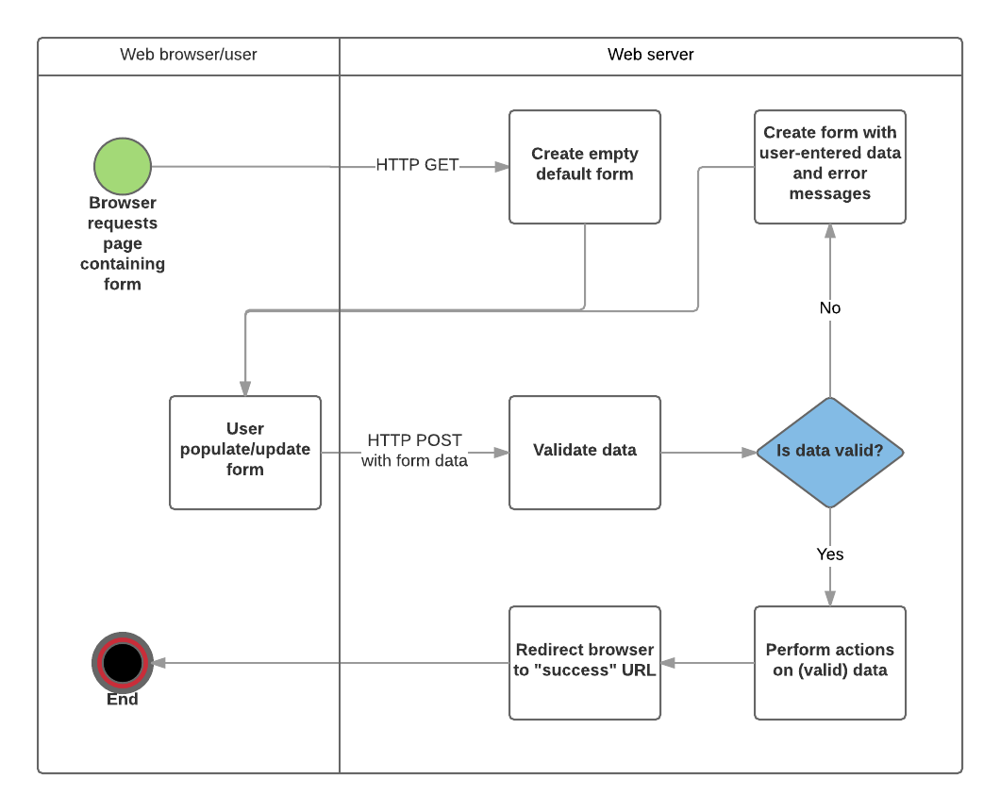

# client / server basics

client and server talk with http

client to server: request (includes the `path` and the `method` (see below))

server to client: response

static server: grabs some files, sends them

dynamic server: builds some files, sends them

most common request methods:

-   POST: Create a new resource (e.g. add a new article to a wiki, add a new contact to a database).
-   GET: Get a specific resource (e.g. an HTML file containing information about a product, or a list of products).
-   PUT: Update an existing resource (or create a new one if it doesn't exist).
-   DELETE: Delete an existing resource

[mozilla](https://developer.mozilla.org/en-US/docs/Learn/Server-side/First_steps/Client-Server_overview)

# node

server-side js

async, event driven

usually sugared with express

# express

sugar module for node

http in > middleware > http out

typical: `app.get(<some route, eg '/'>, <callback>)`

callback will be a function of node / express objects: `error`, `request`, `result`, and `next`

commonly called as: `err`, `req`, `res`, and `next`

`req`: received from the client [(docs)](https://expressjs.com/en/4x/api.html#req)

`res`: sending to the client [(docs)](https://expressjs.com/en/4x/api.html#res)

`next`: tells express to move on to the next thing

_note:_ in many cases, `err` and `next` are omitted

regarding constrained callback variables...

-   think about `Array.forEach`
    -   `things.forEach(thing => ...)`
    -   that's just how `forEach` works. it sequentially feeds the elements of `Array` to `callback`
-   `app.VERB` is similar
    -   it sends `err`, `req`, `res`, and `next` into the callback

```js
const myLogger = function (req, res, next) {
    console.log("Request IP: " + req.ip);
    console.log("Request Method: " + req.method);
    console.log("Request date: " + new Date());

    next(); // THIS IS IMPORTANT!
};

app.use(myLogger);
```

## middleware

middleware functions take the req and res objects, manipulate them, and pass them on through the rest of the app

middleware functions are executed in the order they are instantiated

[middleware docs](http://expressjs.com/en/guide/using-middleware.html)

```js
const express = require("express");
var app = express();

// Custom middleware
function myMiddleware1(req, res, next) {
    req.newProperty = "my custom property";
    next();
}
// Another custom middleware
function myMiddleware2(req, res, next) {
    req.newProperty = "updated value";
    next();
}
app.get("/", (req, res, next) => {
    res.send(`<h1>Custom Property Value: ${req.newProperty}`);
});
// Server listens on http://localhost:3000
app.listen(3000);
```

The middleware functions are defined but not invoked, so `/` will return "Custom Property Value: undefined".

```js
// replace app.get with
app.use(myMiddleware2);
app.get("/", myMiddleware1, (req, res, next) => {
    res.send(`<h1>Custom Property Value: ${req.newProperty}`);
});
```

`app.use(myMiddleware2)` middleware is called before the `app.get('/', myMiddleware1)`, so `/` sends "Custom Property Value: my custom property". If you remove `myMiddleware1` from the route, it will send "Custom Property Value: updated value".

## forms

https://developer.mozilla.org/en-US/docs/Learn/Server-side/Express_Nodejs/forms



# architecture

## MVC

model - view - controller

model: db

view: website

controller: logic


1. `client` send `request` to `server`

    `request` includes the `path` and the `method` (GET, POST, etc)

1. `request` hits `routes`

1. `routes` sends the `request` to the appropriate `controller`

1. `controller` processes the `request`, gets data from the appropriate `model`, and renders the appropriate `template`

1. `server` sends `response` to the `client`

# DB

## ORM

abstraction that lets you address db entries as js objects

## mongo

### schema > model > instance

schema: defines the fields and fieldTypes of a model

model: db table with columns per the schema

instance: db row ... aka record, document

```js
//Require Mongoose
var mongoose = require("mongoose");

// Define schema
var Schema = mongoose.Schema;

var SomeModelSchema = new Schema({
    name: String,
    date: { type: Date, default: Date.now() },
});

// Compile model from schema
var SomeModel = mongoose.model("SomeModel", SomeModelSchema);

// Create an instance of model SomeModel
var awesome_instance = new SomeModel({ name: "awesome" });

// Save the new model instance, passing a callback
awesome_instance.save(function (err) {
    if (err) return handleError(err);
    // saved!
});

// Access model field values using dot notation
console.log(awesome_instance.name); //should log 'also_awesome'

// Change record by modifying the fields, then calling save().
awesome_instance.name = "New cool name";
awesome_instance.save(function (err) {
    if (err) return handleError(err); // saved!
});

// find all instances named Alf, and return the name and date fields
SomeModel.find({ name: "Alf" }, "name date", function (err, alfs) {
    if (err) return handleError(err);
    // 'alfs' contains the list of instances that match the criteria.
});

// you can also buld up a query and execute it later

// find all athletes that play tennis
var query = SomeModel.find({ name: "Alf" });

// selecting the 'name' and 'age' fields
query.select("name date");

// limit our results to 5 items
query.limit(5);

// sort by date
query.sort({ date: -1 });

// execute the query at a later time
query.exec(function (err, alfs) {
    if (err) return handleError(err);
    // alfs contains an ordered list of max 5 instances named Alf
});
```

### relations

```js
var mongoose = require("mongoose"),
    Schema = mongoose.Schema;

var authorSchema = Schema({
    name: String,
    // note we're not referencing stories here, we only want the relation info in one place
    // if we wanted the 'one place' to be here, we could include this:
    // stories: [{ type: Schema.Types.ObjectId, ref: "Story" }],
});

var storySchema = Schema({
    title: String,
    author: { type: Schema.Types.ObjectId, ref: "Author" },
});

var Author = mongoose.model("Author", authorSchema);
var Story = mongoose.model("Story", storySchema);

var bob = new Author({ name: "Bob Smith" });

bob.save(function (err) {
    if (err) return handleError(err);

    //Bob now exists, so lets create a story
    var story = new Story({
        title: "Bob goes sledding",
        author: bob._id, // assign the _id from the our author Bob. This ID is created by default!
    });

    story.save(function (err) {
        if (err) return handleError(err);
        // Bob now has his story
    });
});

// if we want to get all of Bob's stories, we run a query

bobsStories = Story.find({ author: bob._id }).exec(function (err, stories) {
    if (err) return handleError(err);
    // returns all stories that have Bob's id as their author.
});
```

### secrets

[link](https://www.twilio.com/blog/2017/08/working-with-environment-variables-in-node-js.html)

put mongo URI in .env (make sure .env is in .gitignore)

```
MONGODB_URI=mongodb+srv:// etc
```

then

```
npm install dotenv
```

add to top of app.js

```
if (process.env.NODE_ENV !== 'production') {
  require('dotenv').config();
}
```

secret will be available as

```
var mongoDB = process.env.MONGODB_URI;
```

# frontend / backend

rather than an integrated server (template + data = send html)

frontend

-   web apps (react or similar)
-   mobile apps

backend / API

-   db
-   node, but just sending data as JSON

note: good practice to push calcs onto the client. keep your secret sauce on the server, but faster and cheaper on the client

# API

server just sends data. no more views.

## JSON

use `res.json()` instead of `res.render()`

or

app.use(express.json()) and res.send

express.json() causes all data to be received and sent as JSON [link](https://www.robinwieruch.de/node-express-server-rest-api)

## REST

Representation State Transfer

style for setting up api routes

([graphql](https://www.howtographql.com/graphql-js/1-getting-started/) is an alternative to rest, implemented in node with apollo-server (which includes express))

### CRUD

| CRUD   | HTTP   |
| ------ | ------ |
| Create | POST   |
| Read   | GET    |
| Update | PUT    |
| Delete | DELETE |

### the seven routes


## CORS

say node is serving data and views. node has a url, say example.com. the views will be accessed from example.com. meaning, the client and server are both on example.com. put another way, requests are from the same url as the server.

that's called 'same origin'. by default, node enforces a 'same origin policy' by which node will check the url of the request and reject it if it doesn't match the url of the server.

but we want to serve up an api, so we need to accept requests from other urls. CORS is middleware that lets you do that. Cross Origin Resource Sharing.

https://expressjs.com/en/resources/middleware/cors.html

CORS may only apply to cookies? From [jwt.io](https://jwt.io/introduction): "If the token is sent in the Authorization header, Cross-Origin Resource Sharing (CORS) won't be an issue as it doesn't use cookies."

https://developer.mozilla.org/en-US/docs/Web/HTTP/CORS

# auth

sign up > login > protected routes > logout

## passportjs

middleware that handles the plumbing (passing things back and forth between client and server)

works with sessions and jwt

https://dev.to/zachgoll/the-ultimate-guide-to-passport-js-k2l

### howto

note: probably best to ignore this ... see 'connecting front to back'

1. initialize with passport.initialize() (I think? ... seems to work without this)

1. configure a strategy with `passport.use`

    ```js
    // username and password strategy is called LocalStrategy
    passport.use(
        "login", // optional name for the configured strategy. if you don't include this param, the default name is 'local'
        new LocalStrategy(function (username, password, done) {
            // NOTE: you have to write all this stuff ... passport just does the plumbing
            User.findOne({ username: username }, function (err, user) {
                if (err) {
                    return done(err);
                }
                if (!user) {
                    return done(null, false, {
                        message: "Incorrect username or password.",
                    });
                }
                // NOTE: you have to write validPassword method on your UserSchema.methods
                if (!user.validPassword(password)) {
                    return done(null, false, {
                        message: "Incorrect username or password.",
                    });
                }
                return done(null, user);
            });
        })
    );
    ```

1. invoke a strategy on a route with `passport.authenticate`

    ```js
    app.post("/login", passport.authenticate("local"), function (req, res) {
        // If this function gets called, authentication was successful.
        // `req.user` contains the authenticated user.
        res.redirect("/users/" + req.user.username);
    });
    ```

1. logout
    - sessions: req.logout()
    - jwt: it's complicated

## bcrypt

password encryption

```js
const UserSchema = new Schema({
    email: {
        type: String,
        required: true,
        unique: true,
    },
    password: {
        type: String,
        required: true,
    },
});

UserSchema.pre("save", async function (next) {
    const user = this;
    const hash = await bcrypt.hash(this.password, 10);
    this.password = hash;
    next();
});

UserSchema.methods.isValidPassword = async function (password) {
    const user = this;
    const compare = await bcrypt.compare(password, user.password);
    return compare;
};

const UserModel = mongoose.model("user", UserSchema);
```

## server-side sessions / cookies

The credentials used to authenticate a user are transmitted during the login request. If authentication succeeds, a session is established ('<user> is logged in') and maintained via a cookie set in the user's browser.

The session is stored in a server side DB. Every request includes the cookie, which is checked against the DB. This query takes time.

## JSON Web Token / JWT

The server generates a token based on a secret and sends it to the client's localStorage. The token is then passed in every request from the client. On each request, the server calculates the token's validity.

Note there's no database query, so it's faster than server-side sessions.

Some subtleties around expiry:

1. Tokens are defualt valid forever, so you have to specify an expiry when it's created.
1. Item 1. makes logout tricky. Usually, logged out tokens are stored in a DB until they expire. So in practice, you do have to make a query on every req, but the table is much smaller than with sessions, so it's still faster.
1. You also have to think about refreshing the token so an active user isn't logged out on expiry.

```js
// npm module
const jwt = require("jsonwebtoken");
// jwt.sign(payload data, secret, npm module options)
const token = jwt.sign({ user: body }, process.env.SECRET, {
    expiresIn: "30s",
});
```

### token details

header.payload.signature

header is public

payload is public by default. it's possible to encrypt it, but I think the standard approach is to not put anything sensitive in there.

signature is the secure part

    header data => base64 => header

    payload data => base64 => payload

    header + payload + secret => algo => base64 => signature

go to https://jwt.io/#debugger and examine the default token. type some random stuff in for the secret. note that only the signature changes. now alter the payload data. note that both the payload and the signature change. but the secret is wrong, so the altered jwt will fail authentication.

But I'm not sure I understand how the authentication works. I guess it does this:

    1. header + payload + signature => algo => computed_secret

    2. compare computed_secret to secret

# connecting front to back (cookie / session version)

## cookies v jwt

jwt is cool but there's no good way to log out

everything below is assuming cookies

## cookies

on first log in, passportjs will set a cookie

see

-   dev tools / network / response header / Set-Cookie
-   dev tools / storage / cookies (sometimes you have to hit the cookie view refresh button)

it will associate that cookie with a session (which is stored in the db)

when the client sends a request, it will send the cookie

passportjs will check the cookie against the associated session

i think:

-   the cookie identifies the client. you can log in and out as different users, but you will get the same cookie
-   the session tracks which user is associated with the client and if they're logged in

## api

### store session info

i think you need to store session info in a db

`> npm install connect-mongodb-session`

https://www.npmjs.com/package/connect-mongodb-session

```js
// app.js

// at the top
const MongoDBStore = require("connect-mongodb-session")(session);

// ...

const app = express();

// ...

const store = new MongoDBStore({
    uri: mongoDb,
    collection: "sessions",
});

// ...

const sessionSecret = process.env.SECRET;
app.use(
    session({
        secret: sessionSecret,
        cookie: {
            maxAge: 1000 * 60 * 60 * 24 * 7, // 1 week
        },
        store: store,
        resave: false,
        saveUninitialized: true,
    })
);
```

now you'll see a new collection in your db called 'sessions'

note the `maxAge` property in the session options. this sets the cookie expiry

### cors

cross origin resource sharing

say your api is hosted at `http://my-api.com`. any requests from outside `http://my-api.com` will be rejected by default

cors tells the api that certain other origins, like `http://my-client.com`, are ok

further, cors needs to be configured to allow us to send cookies back and forth

https://www.npmjs.com/package/cors#configuration-options

`> npm install cors`

```js
// app.js

// at the top
const cors = require("cors");

// ...

const app = express();

// ...

// https://medium.com/zero-equals-false/using-cors-in-express-cac7e29b005b
let allowedOrigins = [
    "http://localhost:3000",
    "https://bubbletask.netlify.app",
];
app.use(
    cors({
        origin: function (origin, callback) {
            // allow requests with no origin
            // (like mobile apps or curl requests)
            if (!origin) return callback(null, true);
            if (allowedOrigins.indexOf(origin) === -1) {
                var msg =
                    "The CORS policy for this site does not " +
                    "allow access from the specified Origin.";
                return callback(new Error(msg), false);
            }
            return callback(null, true);
        },
        credentials: true,
    })
);
```

the `origin` property allows access

the `credentials` property allows cookies

### passportjs

takes care of auth plumbing

powerful, but poorly documented

define Strategies, invoke them as middleware

app.js ... embed passport into request-response cycle

./auth/auth ... define Strategies (eg sign-up-strategy)

./routes/auth ... invoke Strategies (eg router.post("/sign-up", passport.authenticate("sign-up-strategy"), etc)

#### app.js

```js
// at the top

const passport = require("passport");

// ...

const app = express();

// ...

// passport config
const auth = require("./auth/auth");

// invoke passport on every request
app.use(passport.initialize());
app.use(passport.session());

// need this
app.use(express.urlencoded({ extended: false }));

// bring in some routes
const authRoutes = require("./routes/auth"); // this is sign up, log in, log out
const apiNormalRoutes = require("./routes/api/normal"); // normal
const apiProtectedRoutes = require("./routes/api/protected"); // protected

// invoke authRoutes
// on sign up and log in, passportjs sets a value on req.user
// on log out, passportjs removes the value on req.user
app.use("/auth", authRoutes);

// define a middleware to check the status of req.user
const checkLoggedIn = function (req, res, next) {
    if (req.user) {
        next();
    } else {
        res.json({ message: "woah woah woah woah" });
    }
};

// invoke normal and protected routes
app.use("/api/normal", apiNormalRoutes);
app.use("/api/protected", checkLoggedIn, apiProtectedRoutes);
```

#### ./auth/auth.js

see code comments

```js
const passport = require("passport");
const LocalStrategy = require("passport-local").Strategy;
const bcrypt = require("bcryptjs");
const User = require("../models/user");

passport.use(
    "sign-up-strategy", // assign a name to the Strategy (not documented)
    new LocalStrategy((username, password, done) => {
        User.findOne({ username: username }, (err, user) => {
            if (err) {
                return done(err); // done() is kind of like next()
            }
            if (user !== null) {
                return done("username already taken. sorry", false); // include failure message (not documented)
            }
            bcrypt.hash(password, 10, (err, hashedPassword) => {
                if (err) {
                    return done(err);
                } else {
                    const newUser = new User({
                        username: username,
                        password: hashedPassword,
                    }).save((err, user) => {
                        if (err) {
                            return done(err);
                        } else {
                            return done(null, user); // this sets user on req.user, ie logs in the new user
                        }
                    });
                }
            });
        });
    })
);

passport.use(
    "log-in-strategy",
    new LocalStrategy((username, password, done) => {
        User.findOne({ username: username }, (err, user) => {
            if (err) {
                return done(err);
            }
            if (!user) {
                return done("invalid credentials. try again", false);
            }
            bcrypt.compare(password, user.password, (err, res) => {
                if (res) {
                    return done(null, user);
                } else {
                    return done("invalid credentials. try again", false);
                }
            });
        });
    })
);

// boilerplate below

passport.serializeUser(function (user, done) {
    done(null, user.id);
});

passport.deserializeUser(function (id, done) {
    User.findById(id, function (err, user) {
        done(err, user);
    });
});
```

#### auth routes

sign up, log in, log out

see code comments

```js
// ./routes/auth.js

var express = require("express");
var router = express.Router();

const passport = require("passport");
const bcrypt = require("bcryptjs");

const User = require("../models/user");

// failWithError allows following middleware to see err returned by passport / Strategy / done()
// https://github.com/jaredhanson/passport/issues/458

router.post(
    "/sign-up",
    passport.authenticate("sign-up-strategy", { failWithError: true }),
    function (req, res, next) {
        // Handle success
        return res.send({
            success: true,
            message: "welcome aboard",
            username: req.user.username,
            id: req.user.id,
        });
    },
    function (err, req, res, next) {
        // Handle error
        return res.status(401).send({
            success: false,
            message: err,
            username: null,
            id: null,
        });
    }
);

router.post(
    "/log-in",
    passport.authenticate("log-in-strategy", { failWithError: true }),
    function (req, res, next) {
        // Handle success
        return res.send({
            success: true,
            message: "you're in",
            username: req.user.username,
            id: req.user.id,
        });
    },
    function (err, req, res, next) {
        // Handle error
        return res.status(401).send({
            success: false,
            message: err,
            username: null,
            id: null,
        });
    }
);

// passport makes log out simple enough that you don't need a Strategy
router.get("/log-out", (req, res) => {
    req.logout();
    return res.send({
        success: true,
        message: "you're out",
        username: null,
        id: null,
    });
});

module.exports = router;
```

## client

use fetch exclusively

-   for forms, use onSubmit rather than action and method

fetch options must include `credentials: "include"` to allow cookies

https://github.com/github/fetch#sending-cookies

see code below for the pattern and variations

```js
// component for sign up / in / out and 'get stuff'
// two forms, two buttons
// four methods

const SignUpInOut = (props) => {
    const onSignUp = (e) => {
        e.preventDefault();
        var myHeaders = new Headers();
        myHeaders.append("Content-Type", "application/x-www-form-urlencoded");

        var urlencoded = new URLSearchParams();
        urlencoded.append("username", e.target.username.value);
        urlencoded.append("password", e.target.password.value);

        var requestOptions = {
            method: "POST",
            headers: myHeaders,
            body: urlencoded,
            redirect: "follow",
            credentials: "include",
        };

        fetch(
            // "https://bubbletask-r1.herokuapp.com/auth/sign-up/",
            "http://localhost:8080/auth/sign-up/",
            requestOptions
        )
            .then((response) => response.json())
            .then((data) => {
                props.setCurrentUser(data);
            })
            .catch((error) => console.log("error", error));
    };

    const onSignIn = (e) => {
        e.preventDefault();
        var myHeaders = new Headers();
        myHeaders.append("Content-Type", "application/x-www-form-urlencoded");

        var urlencoded = new URLSearchParams();
        urlencoded.append("username", e.target.username.value);
        urlencoded.append("password", e.target.password.value);

        var requestOptions = {
            method: "POST",
            headers: myHeaders,
            body: urlencoded,
            redirect: "follow",
            credentials: "include",
        };

        fetch(
            // "https://bubbletask-r1.herokuapp.com/auth/log-in/",
            "http://localhost:8080/auth/log-in/",
            requestOptions
        )
            .then((response) => response.json())
            .then((data) => {
                props.setCurrentUser(data);
            })
            .catch((error) => console.log("error", error));
    };

    const onLogOut = (e) => {
        e.preventDefault();
        // fetch("https://bubbletask-r1.herokuapp.com/api/tasks", {
        fetch("http://localhost:8080/auth/log-out", {
            method: "GET",
            credentials: "include",
        })
            .then((response) => response.json())
            // .then((data) => console.log(data))
            .then((data) => {
                props.setCurrentUser(data);
            })
            .catch((error) => console.log("error", error));
    };

    const getStuff = (e) => {
        e.preventDefault();

        // fetch("https://bubbletask-r1.herokuapp.com/api/tasks", {
        fetch("http://localhost:8080/api/tasks", {
            method: "GET",
            credentials: "include",
        })
            .then((response) => response.json())
            .then((data) => console.log(data))
            .catch((error) => console.log("error", error));
    };

    return (
        <>
            <form onSubmit={onSignUp}>
                <label htmlFor="username">
                    <input
                        id="username"
                        name="username"
                        placeholder="username"
                        type="text"
                    />
                </label>
                <label htmlFor="password">
                    <input
                        id="password"
                        name="password"
                        placeholder="password"
                        type="password"
                    />
                </label>
                <button>Sign Up</button>
            </form>
            <form onSubmit={onSignIn}>
                <label htmlFor="username">
                    <input
                        id="username"
                        name="username"
                        placeholder="username"
                        type="text"
                    />
                </label>
                <label htmlFor="password">
                    <input
                        id="password"
                        name="password"
                        placeholder="password"
                        type="password"
                    />
                </label>
                <button>Log In</button>
            </form>
            <button onClick={onLogOut}>Log Out</button>
            <button onClick={getStuff}>Get Stuff</button>
        </>
    );
};

export default SignUpInOut;
```

# deploy

## heroku

heroku has its own git ... you don't have to add a seperate `git init` to a TOP subfolder

when you run `heroku create`, it makes an app and a repo on heroku.com

https://devcenter.heroku.com/articles/git
https://devcenter.heroku.com/articles/preparing-a-codebase-for-heroku-deployment
https://medium.com/@shalandy/deploy-git-subdirectory-to-heroku-ea05e95fce1f

### steps

assuming you're in the TOP repo and you want to deploy a node project that lives in a subfolder

1. in `package.json`, add

    ```
    "engines": {
            "node": "12.18.3"
        }
    ```

1. add a `procfile` at root with one line

    ```
    web: node ./bin/www
    // or
    web: node app.js
    ```

1. heroku only works on port 8000. update `app.listen` to

    ```
    let port = process.env.PORT;
    if (port == null || port == "") {
        port = 8000;
    }
    app.listen(port);
    ```

1. cd to the TOP root

1. create heroku project and repo

    ```
    > heroku create
    Creating app... done, ⬢ thawing-inlet-61413
    https://thawing-inlet-61413.herokuapp.com/ | https://git.heroku.com/thawing-inlet-61413.git
    ```

1. confirm that git's 'heroku' variable is pointing at the right place

    ```
    > git remote -v
    heroku  https://git.heroku.com/thawing-inlet-61413.git (fetch)
    heroku  https://git.heroku.com/thawing-inlet-61413.git (push)
    origin <this will be the 'real' repo on github> (fetch)
    origin <this will be the 'real' repo on github> (push)
    ```

1. if it's not

    ```
    > heroku git:remote -a thawing-inlet-61413
    set git remote heroku to https://git.heroku.com/thawing-inlet-61413.git
    ```

1. commit everything to `main` the usual way (`git add .`, etc)

1. deploy the node project to heroku with `git subtree`

    ```
    git subtree push --prefix path/to/subdirectory heroku main

    // example:
    git subtree push --prefix node/message-board heroku main
    ```

1. config

    set environment to production

    ```
    heroku config:set NODE_ENV='production'
    ```

    set MONGODB_URI environment variable (note: should use separate DB for dev and prod)

    ```
    // put a space in front to keep it out of the shell cache
     heroku config:set MONGODB_URI='mongodb+srv:// etc
    ```

    inspect config

    ```
    heroku config
    ```

1. rename the app

    ```
    heroku apps:rename newname --app oldname

    // example
    heroku apps:rename top-message-board --app pure-lake-23744
    ```

# curl

command line utility to talk to servers

windows has its own crummy version

when you install git, you get the real curl

but windows aliases curl to its crummy version

go to windows terminal $profile (not settings.json) and remove the alias

now curl goes to the real curl

curl / json in powershell is a pain

add --%, use double quotes throughout json, and escape all the inner ones with \

curl --% -X POST -H "Content-Type:application/json" http://localhost:3000/messages -d "{\"text\":\"Hi again, World\"}"
